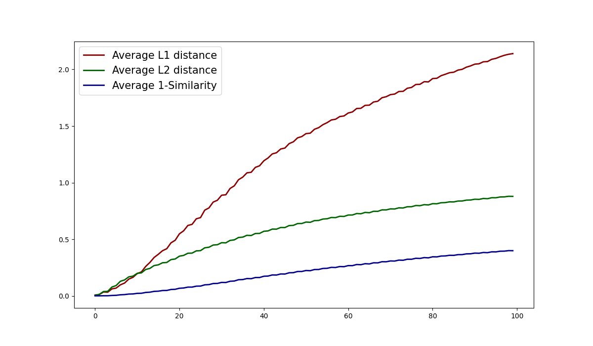

# Blur face detection $L1$, $L2$ distance and Cosine similarity test
---
# 1. Blurring code required to give blur step by step
```python
# Blurring from defocus(manually control degree and angle)
def blurring(img, d=None, angle=None):
    if d is None:
        random_degree = random.randint(0, 100)
    else:
        random_degree = d

    if angle is None:
        random_angle = random.randint(-180, 180)
    else:
        random_angle = angle

    if random_degree == 1:
        random_angle = random.randint(-88, 88)

    if random_degree == 0:
        image = np.array(img)
        cv2.normalize(image, image, 0, 255, cv2.NORM_MINMAX)
        blurred = np.array(image, dtype=np.uint8)

    else:
        # Create random motion blur kernel
        M = cv2.getRotationMatrix2D((random_degree / 2, random_degree / 2), random_angle, 1)
        kernel = np.diag(np.ones(random_degree))
        kernel = cv2.warpAffine(kernel, M, (random_degree, random_degree))
        kernel = kernel / random_degree

        # Apply kernel on the image sample
        image = np.array(img)
        blurred = cv2.filter2D(image, -1, kernel)
        cv2.normalize(blurred, blurred, 0, 255, cv2.NORM_MINMAX)
        blurred = np.array(blurred, dtype=np.uint8)

    return blurred, random_degree/100
```
---
# 2. Generate samples
- 30 reference images
- 100(0~100) degrees( $d$ )
- random angle( $\theta$ ) or fixed angle( $\theta$ )

### (1) Generate samples with random angle( $\theta$ )
```python
image_root = './data/FFHQ_1024/clean/'

look_upto = 0
for file in os.listdir(image_root):
    if os.path.splitext(file)[-1] not in ['.png', '.jpg']:
        continue

    look_upto += 1
    image_name = os.path.splitext(file)[0]
    os.makedirs(os.path.join(image_root, image_name), exist_ok=True)
    clean_img = cv2.imread(os.path.join(image_root, file))
    print(f"Creating blur images [{look_upto}/30]")
    for i in tqdm(range(101)):
        blurred_img, _ = blurring(clean_img, d=i)
        cv2.imwrite(os.path.join(image_root, image_name, f'random_{i}.png'), blurred_img)

    if look_upto == 30:
        break
```

### (2) Generate samples with fixed angle( $\theta$ )
```python
image_root = './data/FFHQ_1024/clean/'

look_upto = 0
for file in os.listdir(image_root):
    if os.path.splitext(file)[-1] not in ['.png', '.jpg']:
        continue

    look_upto += 1
    image_name = os.path.splitext(file)[0]
    os.makedirs(os.path.join(image_root, image_name), exist_ok=True)
    clean_img = cv2.imread(os.path.join(image_root, file))
    print(f"Creating blur images [{look_upto}/30]")
    for i in tqdm(range(101)):
        blurred_img, _ = blurring(clean_img, d=i, angle=45)
        cv2.imwrite(os.path.join(image_root, image_name, f'fix_{i}.png'), blurred_img)

    if look_upto == 30:
        break
```
---
# 3. Calculate distance and similarity average
```python
# Get average distances from angle random samples
def calculate_distances(img_dir, idx):
    reference_img = cv2.imread(os.path.join(img_dir, 'random_0.png'))
    emb_clean = resnet(torch.Tensor(reference_img).permute(2, 0, 1).unsqueeze(0))
    blurred_img = cv2.imread(os.path.join(img_dir, f'random_{idx}.png'))
    emb_blur = resnet(torch.Tensor(blurred_img).permute(2, 0, 1).unsqueeze(0))
    l1 = L1_distance(emb_clean, emb_blur)
    l2 = L2_distance(emb_clean, emb_blur)
    cossim = cos_sim(emb_clean.squeeze(0).detach().numpy(), emb_blur.squeeze(0).detach().numpy())
    return blurred_img, l1, l2, cossim
    
# Get average distances from angle fixed samples
def calculate_distances(img_dir, idx):
    reference_img = cv2.imread(os.path.join(img_dir, 'fix_0.png'))
    emb_clean = resnet(torch.Tensor(reference_img).permute(2, 0, 1).unsqueeze(0))
    blurred_img = cv2.imread(os.path.join(img_dir, f'fix_{idx}.png'))
    emb_blur = resnet(torch.Tensor(blurred_img).permute(2, 0, 1).unsqueeze(0))
    l1 = L1_distance(emb_clean, emb_blur)
    l2 = L2_distance(emb_clean, emb_blur)
    cossim = cos_sim(emb_clean.squeeze(0).detach().numpy(), emb_blur.squeeze(0).detach().numpy())

    return blurred_img, l1, l2, cossim
```

### [Example of code to calculate distance]
### (1) Use numpy
```python
def L1_distance(emb1, emb2):
    return np.sum(np.abs(emb1 - emb2))

def L2_distance(emb1, emb2):
    return np.sqrt(np.sum(np.square(emb1 - emb2)))

def cos_sim(emb1, emb2):
    return np.dot(emb1, emb2)/(np.linalg.norm(emb1)*np.linalg.norm(emb2))
```
or you can just use np.linalg.norm like below
```python
def L1_distance(emb1, emb2):
    return np.linalg.norm(emb1-emb2, 1)

def L2_distance(emb1, emb2):
    return np.linalg.norm(emb1-emb2, 2)

def cos_sim(emb1, emb2):
    return np.dot(emb1, emb2)/(np.linalg.norm(emb1)*np.linalg.norm(emb2))
```

### (2) Use pytorch
```python
def L1_distance(emb1, emb2):
    return torch.norm(emb1-emb2, p=1, dim=1).item()

def L2_distance(emb1, emb2):
    return torch.norm(emb1-emb2, p=2, dim=1).item()

def cos_sim(emb1, emb2):
    return F.cosine_similarity(emb1, emb2, 1).item()
```

* Be careful with tensor dimension

---
# 4. Average distance and similarity on 30 samples
$$ L_1(j)^{avg} = \frac{1}{30} \sum_{i=0}^{29} \left| e_i - \epsilon_i^j \right| $$

$$ L_2(j)^{avg} = \frac{1}{30} \sqrt{\sum_{i=0}^{29} \left( e_i-\epsilon_i^j \right)^2} $$

$$ \text{Similarity}(j)^{avg} = \frac{1}{30} = \frac{1}{30} \sum_{i=0}^{29} \left( \frac{\left| e_i \cdot \epsilon_i^j \right|}{\left| e_i \right| \times \left| \epsilon_i^j \right|} \right) $$

for reference face embedding $e_i = g(r_i)$ from face recognition model $g(\cdot)$ inference on reference face image $r_i$.
and blurred face embedding $\epsilon_i^j = g(b_i^j)$ from face recognition model inference on blurred face image $k_j * r_i$ with $j^{th}$ blur kernel $k_j$.

```python
resnet = InceptionResnetV1(pretrained='vggface2').eval()
path = './data/FFHQ_1024/clean/'

look_upto = 0
l1_mean, l2_mean, cos_mean = np.zeros(100), np.zeros(100), np.zeros(100)

for subpath in os.listdir(path):
    if os.path.splitext(subpath)[-1] not in ['.png', '.jpg']:
        sample_path = os.path.join(path, subpath)
        look_upto += 1
        for i in tqdm(range(1, 101)):
            _, l1, l2, cossim = calculate_distances(sample_path, i)
            l1_mean[i-1] += l1
            l2_mean[i-1] += l2
            cos_mean[i-1] += cossim

        if look_upto == 30:
            break

l1_mean /= look_upto
l2_mean /= look_upto
cos_mean /= look_upto
```

---
# 5. Visualize results
## (1) Average distances and similarity for samples generated with random $\theta$.
<p align="center">

## (2) Average distances and similarity for samples generated with fixed $\theta$.
<p align="center">

---
# 6. Additional test
PSNR and SSIM, commonly indicators for measuring image or image quality, have been found to be difficult to be used as visual indicators of blur. PSNR is the noise ratio for the maximum signal calculated based on pixel by pixel difference, and if the image to be compared is shifted to the reference image, it is judged that it is actually more corrupt than the image with a lot of blur.

$$ MSE = \frac{\sum_{M, N} \left[ I_1(m, n) - I_2(m, n) \right]^2 }{M * N} $$

$$ PSNR = 10 \log_{10} \left( \frac{R^2}{MSE} \right) $$

Unlike PSNR, SSIM is a method designed to evaluate human visual quality differences rather than numerical errors, and Luminance, Contrast, and Structural evaluate quality in three aspects. However, it was judged that the degree of blur could not be visually represented because there was a parameter that looked at the structural side of the pixel along with PSNR.

$$ SSIM(x, y) = \left[ l(x, y) \right]^\alpha \cdot \left[ c(x, y) \right]^\beta \cdot \left[ s(x, y) \right]^\gamma $$

$$ SSIM(x, y) = \frac{(2\mu_x \mu_y +C_1)(2 \sigma_{xy}+C_2)}{(\mu_x^2+\mu_y^2+C_1)(\sigma_x^2+\sigma_y^2+C_2)} $$

<p align="center">

As can be seen from the figure above, it can be seen that the image on the left looks clearer visually than the image on the right, but the results of PSNR and SSIM metric appear opposite to each other. However, if you extract the same sample through pretrained-FaceNet(https://github.com/timesler/facenet-pytorch) and utilize it to obtain cosine similarity,

<p align="center">

It can be seen that the image on the clean left is the same (1.00) as the original person, and the image on the right side with the blur shows a lower cosine similarity(0.88), reflecting the visual blur. This also shows good results in the tendency to angles, for example, if you look at the sample and the cosine similarity,

<p align="center">

In fact, the image on the right has more blurs on the degree ( $d$ ), but the image on the left is more blurred by the angle( $\theta$ ) of the kernel that produces motion blur. Even in this case, it can be seen that cosine simplicity well represents an image that looks more visually blurred.
