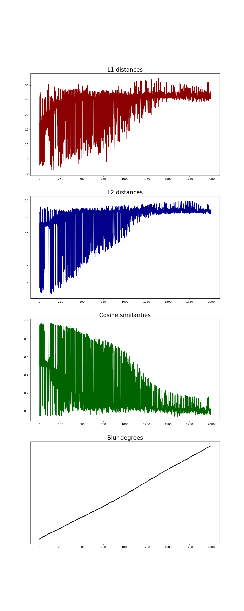
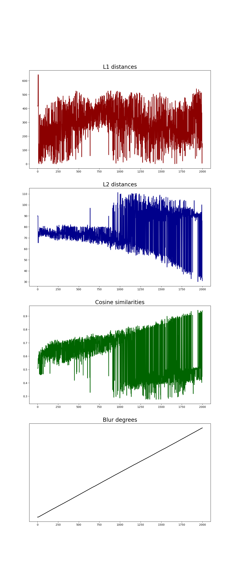
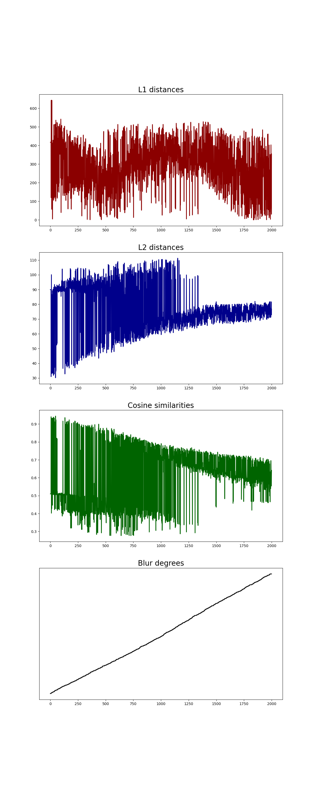
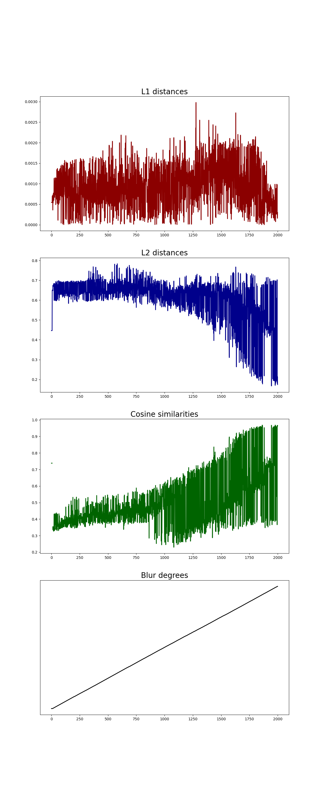

# Face blurring
https://github.com/junia3/FaceBlurring
### Generate face blurring dataset
---
# Process to create and save face blur images
conda virtual environment setup(recommend python=3.7+)
```bash
conda create -n "environment name" python=3.8
conda activate "environment name"
```
## requirements..
---
### Install insightface(SCRFD)
```bash
pip install -U Cython cmake numpy
pip install onnxruntime-gpu
pip install -U insightface
```
### Install for image processing
```bash
pip install numpy
pip install scipy
pip install opencv-python
conda install scikit-image
pip install tqdm
```

### Install pytorch in your computer(follow CUDA spec)
https://pytorch.org/get-started/locally/

## 1. Cloning repository and get ready to generate samples

```bash
  git clone https://github.com/junia3/FaceBlurring.git
```
You can just cloning this repo into your own computer  
And finally the directory hierarchy is configured as,  

```bash
FaceBlurring
├── config
│   ├── test.txt
├── dataset
│   ├── blur.py
│   ├── create_blurring.py
│   ├── dataset.py
│   └── utils.py
└── data
``` 
This is just a framework to create dataset. You should add your own "face dataset" into 'data' directory.
### test.txt
```txt
../data/sample_root/
```
If you add your own data samples to directory, add all data roots in the test.txt file line by line. For example, if you configured data samples like below,
```
...
data
├── sample_root1
│   ├── clean
│   │   ├── face_sample0.png(or .jpg)
│   │   ├── face_sample1.png(or .jpg)
│   │   ├── face_sample2.png(or .jpg)
├── sample_root2
│   ├── clean
│   │   ├── face_sample0.png(or .jpg)
│   │   ├── face_sample1.png(or .jpg)
│   │   ├── face_sample2.png(or .jpg)
└── sample_root3
```
```
...
data
├── sample_root1
│   ├── clean (<-> blur)
│   │   ├── folder1
│   │   │      ├── face_sample0.png(or jpg)
│   │   │      ├── face_sample1.png(or jpg)
│   │   │      ├── face_sample2.png(or jpg)
│   │   ├── folder2
│   │   │      ├── face_sample0.png(or jpg)
│   │   │      ├── face_sample1.png(or jpg)
│   │   │      ├── face_sample2.png(or jpg)
│   │   ├── folder3
│   │   │      ├── face_sample0.png(or jpg)
│   │   │      ├── face_sample1.png(or jpg)
├── sample_root2
│   ├── clean
│   │   ├── folder1
│   │   ├── folder2
│   │   ├── fdoler3
└── sample_root3
```
You have to update test.txt file as
```txt
../data/sample_root1/
../data/sample_root2/
../data/sample_root3/
```

to generate blur images for all files in sample roots.  
You should first get samples and make directory like above structure(warning!!!! you cannot change directory name "clean" or "data", but you can freely change name of "sample_root")

---
## 2. create and save blur data samples
(Updated 22/08/04) I made two options to create blur images
- method from deblurGAN
(https://openaccess.thecvf.com/content_cvpr_2018/html/Kupyn_DeblurGAN_Blind_Motion_CVPR_2018_paper.html) and github https://github.com/KupynOrest/DeblurGAN

- method from Defocus and Motion Blur Detection with Deep Contextual Features(https://onlinelibrary.wiley.com/doi/full/10.1111/cgf.13567) and github https://github.com/Imalne/Defocus-and-Motion-Blur-Detection-with-Deep-Contextual-Features

I show an example command to create blurred images and save them with label information
```bash
   cd /dataset
   python create_blurring.py --blur defocus --save True --label True
```
Above command would generate blurred image with defocus method. Another option is 'deblurGAN'
```bash
   cd /dataset
   python create_blurring.py --blur deblurGAN --save True --label True
```
and simply you can just generate blur images and save them with labels, into default setting(defocus, save images and label).
```bash
   cd /dataset
   python create_blurring.py
```
There are four metrics(PSNR, SSIM, degree(never recommended..), cosine) to create labels(22/08/16). I'll show an example command to create blurred samples and save them with cosine similarity label information(+SCRFD inference).
```bash
   cd /dataset
   python create_blurring.py --blur defocus --save True --label True --calc cosine --scrfd True
```
---
## 3. Evaluate and Visualize samples
I created dataset module, and check how the images are labeled with psnr metric(it can be updated later with better metrics).
You can run dataset example 'after' generate blurred images.
```bash
   cd /dataset
   python dataset.py
```
And do not forget to update 'text.txt' before run this command.

---
## 4. Embedding test with dataset
Open "Tutorial.jpynb" with google colab.
### Results with deepface(Facenet).  
| PSNR | SSIM | Blur Degree |
|------------|-------------|-------------|
|  |  | |  

### Results with deepface(DeepFace).  
| PSNR | SSIM | Blur Degree |
|------------|-------------|-------------|
|  |  | |

### Results with deepface(ArcFace).  
| PSNR | SSIM | Blur Degree |
|------------|-------------|-------------|
|  |  | |

### Results with deepface(VGG-Face).  
| PSNR | SSIM | Blur Degree |
|------------|-------------|-------------|
|  |  | |

---
## Train baseline models with generated dataset
#### 1. Generate dataset
- method from Defocus and Motion Blur Detection with Deep Contextual Features(https://onlinelibrary.wiley.com/doi/full/10.1111/cgf.13567) and github https://github.com/Imalne/Defocus-and-Motion-Blur-Detection-with-Deep-Contextual-Features
- Gaussian(or uniform) random variable to choose pixel values for motion blurring
- Degree : $d/d_{max}$
- $d_{min} = 0, d_{max} = 100$
- Code below
```python
  if random_degree == 0:
      image = np.array(img)
      cv2.normalize(image, image, 0, 255, cv2.NORM_MINMAX)
      blurred = np.array(image, dtype=np.uint8)

  else:
      # Create random motion blur kernel
      M = cv2.getRotationMatrix2D((random_degree / 2, random_degree / 2), random_angle, 1)
      kernel = np.diag(np.ones(random_degree))
      kernel = cv2.warpAffine(kernel, M, (random_degree, random_degree))
      kernel = kernel / random_degree

      # Apply kernel on the image sample
      image = np.array(img)
      blurred = cv2.filter2D(image, -1, kernel)
      cv2.normalize(blurred, blurred, 0, 255, cv2.NORM_MINMAX)
      blurred = np.array(blurred, dtype=np.uint8)
```
  
- Random trajectories with random $d$ and $\theta$ to create blur images
- Use cosine similarity metric

#### 2. Build mobilenet(V1, V2) and Small ResNet architecture for regression
#### 3. Train mobilenet(V2) with blur samples
#### 4. Train ResNet with blur samples
... To be updated
