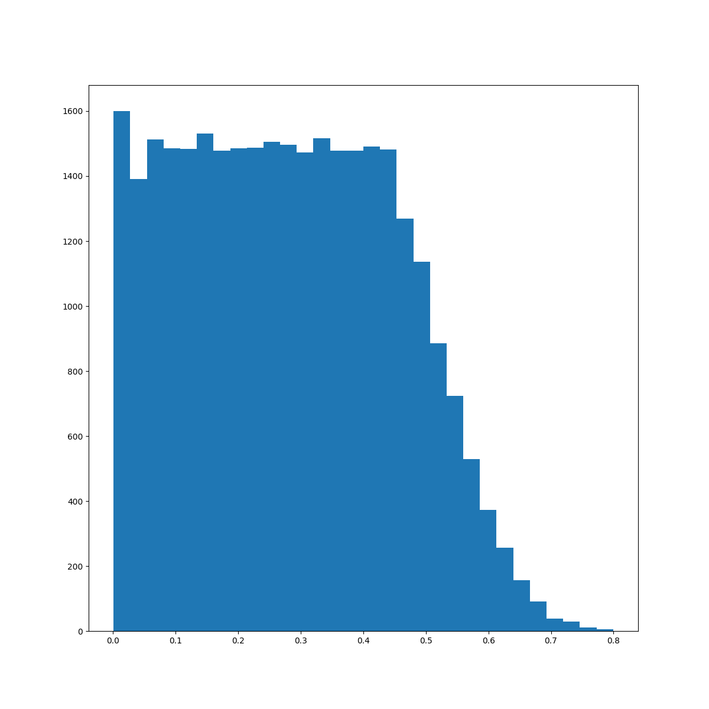
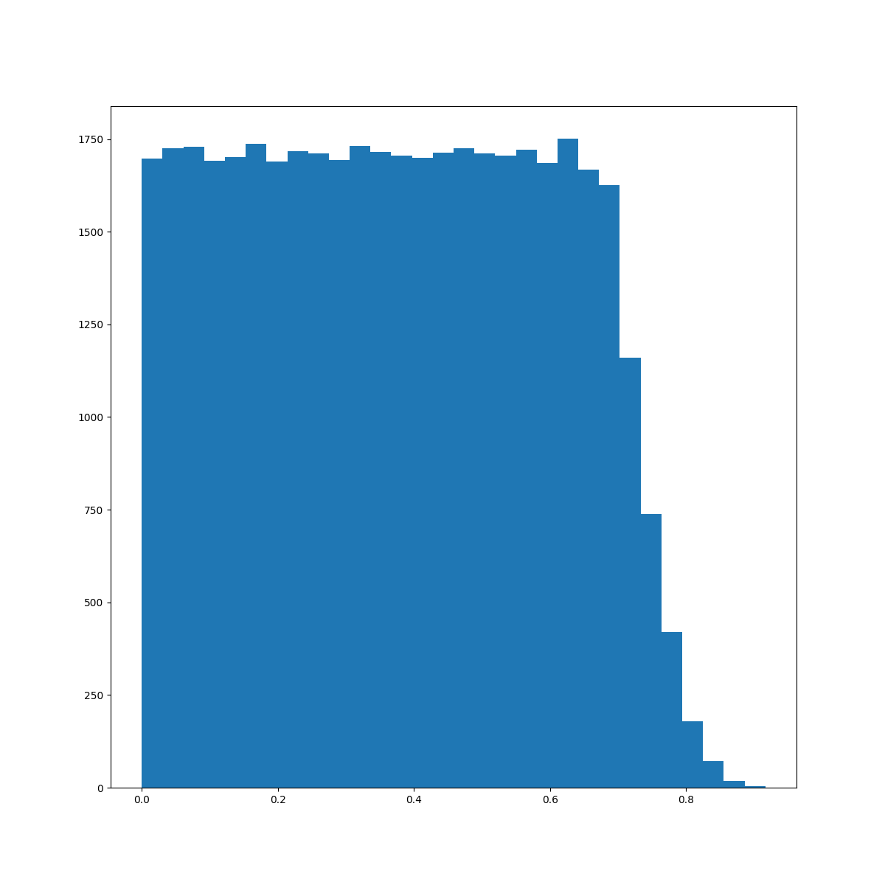
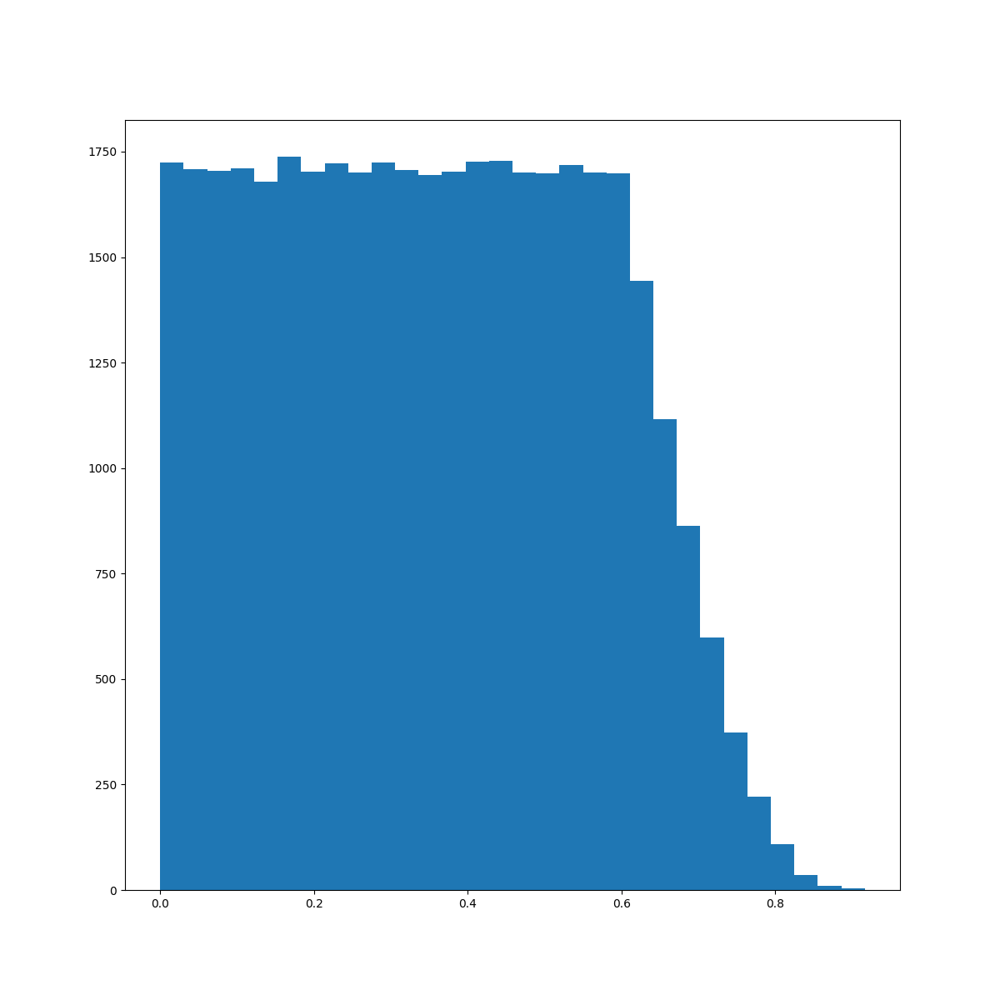
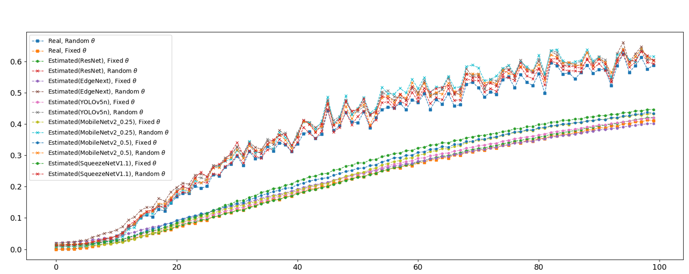

<!-- <p align="center"><a href="#">
    
</a></p> -->


<!-- <h4 align="center">Hi 👋</h4> -->

<p align="center"; font-size=24px><b>This Project is done by YAI 10th, cooperating with Alchera </b></p>
</br>
---

### Members
<p align="left"; style="margin:0px 280px"> <b>
</br> &nbsp; 👑 KIM MINSU, YAI 7th
</br> &nbsp; 🚀 KIM HYUNJIN, YAI 8th
</br> &nbsp; 🎓 PARK JUNYOUNG, YAI 9th
</br> &nbsp; 🚀 LEE SUMIN, YAI 9th
</br> &nbsp; 🐯 JIN HYUNBIN, YAI 9th
</br> &nbsp; 😀 CHOI SUNGBUM, YAI 9th
</b></p> 

<!-- YAI logo -->
<!-- <p align="center"><a href="#">
 
</a></p -->

</br>
<p align="center">
<a href="mailto:minsumunsu@gmail.com">
    
</a> 
<a href="https://gabby-mouth-b6b.notion.site/x-YAI-Blurred-Face-Detection-cdad82a5d24c4d0b80ea3957e4296407">
    
</a> 

</br>


</p>

</br>

---

## Requirements
</br>

### Conda virtual environment setup (recommend python>=3.7)

```
conda create -n "environment name" python=3.7
conda activate "environment name"
```
</br>

### Install insightface(SCRFD)

```
pip install -U Cython cmake numpy
pip install onnxruntime-gpu
pip install -U insight-face
```
</br>

### Environment setting

```
pip install torch>=1.8.1 
pip install torchvision>=0.9.1
pip install pytorch-lightning
pip install numpy
pip install scipy
pip install opencv-python
conda install scikit-image
pip install tqdm
```
</br>

### Git clone repo

```
git clone https://github.com/minsu1206/BlurFaceDetection.git
```

You can just clone this repo into your own computer

</br>

And finally the directory hierarchy is configured as,

```
FaceBlurring
├── config
│      ├── resnet18_regression.yaml
│      └── .....
├── data
├── data_samples
├── dataset
│      ├── blur.py
│      ├── create_blurring.py
│      ├── dataset.py
│      ├── utils.py
│      └── .....
├── experiments
│      ├── results
│      ├── sample_code
│      └── .....
├── legacy
├── models
│      ├── utils # dir for yolov5n.py 
│      ├── edgenext.py
│      ├── mobilenetv2.py
│      └── .....
├── loss.py
├── model_factory.py
├── recorder.py
├── sample.sh
├── test.py
├── train.py
└── utils.py
```

---

## Dataset
</br>

### Download data

- FFHQ
    - [https://github.com/NVlabs/ffhq-dataset](https://github.com/NVlabs/ffhq-dataset)
    - The FFHQ dataset consists of 70,000 high-quality PNG images at 1024×1024 resolution and contains considerable variation in terms of age, ethnicity and image background.
    - Download 1024×1024 images as png (89.1GB)
    
    ```
    cd /data
    wget https://raw.githubusercontent.com/NVlabs/ffhq-dataset/master/download_ffhq.py
    python ./download_ffhq.py --images
    cd ../
    ```
    
- Our processed data (resolution : 112px)
    
    You can download the blurred images we created from the link below.
    
    - [https://drive.google.com/drive/folders/1zSfqyeqSlpENTpi6BRcuV6hW9VIkOZsR?usp=sharing](https://drive.google.com/drive/folders/1zSfqyeqSlpENTpi6BRcuV6hW9VIkOZsR?usp=sharing)

</br>

### Create & save data

I made two methods to create blur images

- DeblurGAN
    - paper : [https://openaccess.thecvf.com/content_cvpr_2018/html/Kupyn_DeblurGAN_Blind_Motion_CVPR_2018_paper.html](https://openaccess.thecvf.com/content_cvpr_2018/html/Kupyn_DeblurGAN_Blind_Motion_CVPR_2018_paper.html)
    - github : [https://github.com/KupynOrest/DeblurGAN](https://github.com/KupynOrest/DeblurGAN)
- Defocus and Motion Blur Detection with Deep Contextual Features
    - paper : [https://onlinelibrary.wiley.com/doi/full/10.1111/cgf.13567](https://onlinelibrary.wiley.com/doi/full/10.1111/cgf.13567)
    - github : [https://github.com/Imalne/Defocus-and-Motion-Blur-Detection-with-Deep-Contextual-Features](https://github.com/Imalne/Defocus-and-Motion-Blur-Detection-with-Deep-Contextual-Features)

You have two options to create blur images. The first option is to apply blur iteratively to an clean image. Second option is to apply blur method only once. As blur label, we use 1-cosine similarity.

</br>

### How to make : Guide

I show an example command to create blurred images and save them with label information.

```
cd ./dataset
python create_blurimg_iterative.py --path ../data/FFHQ_1024/clean --n 4
python create_blur_label.py --path ../data/FFHQ_1024/clean 
```

Above command would generate set of blurred images which were applied blur method four times iterative. 

```
cd ./dataset
python create_blurimg_iterative.py --path ../data/FFHQ_1024/clean --n 4
python create_blur_label.py --path ../data/FFHQ_1024/clean --wo --multi
```

Above command would generate set of blurred images using multiprocess to generate faster. 

```
cd ./dataset
python create_blur_image.py --blur defocus --iter 1
```

It’s how to generate blurred images with Defocus method. One blur image is generated for one clean image.

```
cd ./dataset
python create_blur_image.py --blur deblurgan --iter 1
```

This command would use DeblurGAN blur method to generate blur images.

```
cd ./dataset
python create_blur_image.py --blur defocus --iter 1 --scrfd True
```

This command would generate blur images using defocus blur method and SCRFD inference. SCRFD module is used to detect face in an image.

All generated blur images are stored in the “data” folder.

```
data
├── FFHQ_1024
│      ├── blur_deblurGAN
│      │      ├── 00000
│      │      │      ├── 00000.png
│      │      │      ├── 00001.png
│      │      │      ├── .....
│      │      │      └── 00999.png
│      │      ├── 01000
│      │      │      ├── 01000.png
│      │      │      ├── 01001.png
│      │      │      ├── .....
│      │      │      └── 01999.png
│      │      └── .....
│      ├── blur_defocus
│      │      ├── 00000
│      │      │      ├── 00000.png
│      │      │      ├── .....
│      │      │      └── 00999.png
│      │      └── .....
│      └── blur_Random
│             ├── 00000
│             │      ├── 00000.png
│             │      ├── .....
│             │      └── 00999.png
│             └── .....
├── label_deblurGAN
│      └── label
│             └── data_label.csv
├── label_defocus
│      └── label
│             └── data_label.csv
├──label_random
│      └── label
│             └── data_label.csv
└──label_val.csv
```
</br>

### Data distribution

The following code is used to plot the distribution of the generated blur images.(Below is an example using the deblurgan method)

```
python data_distribution.py --path ../data/label_deblurGAN/label/data_label.csv
```

The distribution of the data we provided is as follows. (The x-axis is the blur label, and the y-axis is the number of images. The graph is sequentially using DeblurGAN method, Defocus method, and both methods.) 

<p align="center"></p>

<p align="center"></p>

<p align="center"></p>

210,000 samples were generated with random motion blur kernels according to deblurGAN, defocus methods. Extracted 100,000 samples among them, so that the overall dataset samples were evenly distributed. Look at the image below.

<p align="center">

</p>

---
</br>

## Train
</br>

### Supported model

Basically, we provide a models such as resnet, and also provide light weight backbones which show a fast interference speed.

| Model | Model Size </br> (.pt file) | Inference speed : </br> Average | Config |
| --- | --- | --- | --- |
| ResNet18 | 42.916 MB | 143.502 (ms) | resnet18_regression.yaml |
| ResNet34 | 81.542 MB | 263.5752 (ms) | - |
| EdgeNext_xx_small | 4.49 MB | 155.0043 (ms) | edgenext_regression.yaml |
| YOLOv5n (custom backbone : x) | 4.106 MB | 132.2865 (ms) | yolov5n_regression.yaml |
| YOLOv5n (custom backbone : xx) | 2.213 MB | 129.8896 (ms) | yolov5n_regression.yaml |
| MobileNetV2_0.25 | 1.068 MB  | 111.6102 (ms) | mobilenetv2_regression.yaml |
| MobileNetV2_0.5 | 2.815 MB | 123.4103 (ms) | mobilenetv2_regression.yaml |
| EfficientNetLite0 | 13.137 MB | 185.1595 (ms) | - |
| SqueezeNetV1.1 | 2.785 MB | 57.3412 (ms) | squeezenet_regression.yaml |

</br>

### Train code

If you want to train the code, please refer to the training script below.

```
> python train.py --config config/{}.yaml --save {} --device {} --viz

optional arguments:
	--config								select yaml file to run (in config folder)
	--save									set a path to save checkpoint and graph
	--device								select a device (ex cuda:@)
	--viz										add if you want to visualize

EX)
> python train.py --config mobilenetv2_0.5_regression --save checkpoint/mobilenetv2_0.5 --device cuda:0 --viz
```

---
</br>

## Evaluation

### Performance : Baseline & Lightweight models

<p align="center"></p>

This figure shows that our designed model predicts motion blur well and their error is close to zero when compared to GT whether the blur angle is fixed or not. (Also whatever the backbone is!) Each model’s result is the mean of result about 30 people.

</br>

### Ablation Study (1) : ResNet18 vs ResNet18 with complex regressor

<p align="center"></p>

This figure shows that ResNet with simple structure predicts better than one with complex structure. Furthermore, the stack of linear layers increases the inference speed and model size. Therefore, we don’t fix any regressor (fc layer) of all the models we used at this project.

</br>

### Ablation Study (2) : How about solving this problem as Classification?

<p align="center"></p>
<p align="center"></p>

> (Upper) : ResNet trained by classfication </br>
(Bottom) : EdgeNext_xx_samll trained by classification

We divide 0 ~ 1 into N (20, 40) classes. i-th Class (i=0~N-1) means GT blur degree is between i/N ~ (i+1)/N, so regression label can be changed into classification label.

We train ResNet and EdgeNext_xx_small with cross entropy + MSE (CMSE) or crossentropy + probability based MSE (WeightMSE, WMSE). These figures show that solving this task as classification is also valid approach.


</br>

<p align="center"><a href="#">
    
</a></p>
